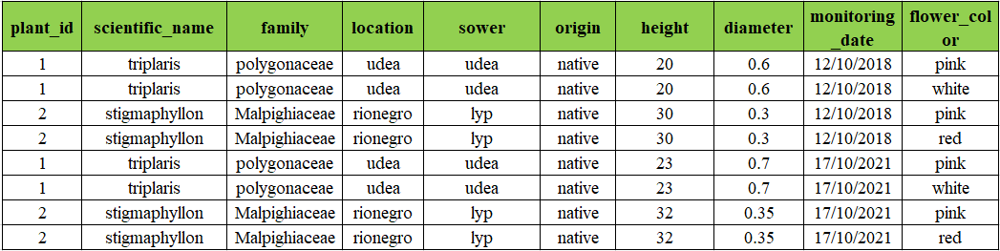
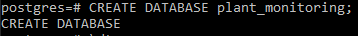

## :scroll:Description 
Here in this project, we will create a database which objective is store data from plant monitoring, we will use Postgresql and Mockaroo data generator to construct our database. 

**:book:For example:** suppose each month we go out and record the height and trunk diameter of some plants we would like to monitor frequently, so this database will help us to organizatelly store the data; additionally this database will have information about the scientific identification, location and origin of every plant

## Database Normalization :minidisc:
In this section we will make an excercise where we normalize an initial table which has data about 2 monitorings and 2 plant species; this table is unorganized because does not follows the normal forms, so we will go step by step showing how to correctly organize this information. 

#### Table 1. Unorganized table. :bar_chart:

In the previus table we see that there are some columns that repeat, like **monitoring_date_1** and **monitoring_date_2** or **height_1** and **height_2**. This can't happen because it violates the normal forms rules; so the next table fixes this issue to produce a table in the first normal form. 

#### Table 2. first normal form table. :bar_chart:

This table does not have repeated columns, so we have now a table in the first normal form.

To transform this table into the second normal form, we must ensure the table has a single column primary key, in this case our table does not satisfies this condition, because the column **plant_id** is not **UNIQUE**. To do this, we think it's a good idea to create 2 tables, which have THE SAME INFORMATION AS THE Table 2, but with the information organized differently, also these two tables has each one a UNIQUE primary key. 

#### Table 3. second normal form tables. :bar_chart:

These two tables satisfy the second normal form.

To transform these tables into the third normal form, we must separate the entities that do not have relations 1:1 (one-to-one relations). 

**for example** the relationship between plant and scientific_name is not 1:1, because different individual plants can have the same scientific_name, so the relationship here is 1:N; the same happens for family, location, sower and origin. 

**Something special** happens with the relationship between plant and flower_color, because one individual plant can have different colors in its flower and one color can be in different flower species, we can say that this relationship is N:N (many-to-many relationship). So to correctly relationate these two entities, we need a transitory or intermediate table, in this case we named it: **'plant_flower_color'**, this is a simple table which has a primary key and the information of which plant_id has which color.  

#### Table 4. third normal form tables and 'intermediate' table :bar_chart:

With the previous procedure, we have, at least, the third normal form, and this is anough for the porpuse of this project. 

## Database and table creation. :minidisc:

#### Database creation :fountain_pen:

we will use the command **CREATE DATABASE 'database_name';** to create our database; in this case, our database will be named: *'plant_monitoring'*

The commands to create the tables are pretty simple, to do this we use this structure: **CREATE TABLE table_name (column_1 datatype, column_2 datatype, ...);**, The next figure is an example which creates the table 'scientific_names', which saves all the scientific names of plants. 

#### Figure 1. query to create the table 'scientific_names'

Following the preovious procedure, all the remaining tables can be created. 

**NOTE:exclamation::** all the queries for table creation are located in folder **'code_for_table_creation'**; for every table there is a .sql file which can be easily executed in postgreSQL using the command **'\i'**, avoiding us to write directly the queries on the terminal.  

**NOTE:exclamation::** be careful while you are creating the tables, because the order of creation is very important. you MUST create the independent tables FIRST and then the dependent tables; also the LAST table that should be created is the **intermediate** table.

**:fountain_pen:Independent tables:** tables that does not have Foreign keys

**:fountain_pen:Dependent tables:** tables that does have Foreign keys

**NOTE:exclamation:** in the .sql code for table creation is included the Primary and Foreign keys instructions, specially for **plants** table, which is the central one.

## Data Ingestion :minidisc:

Once the database and tables have been created, the next step is feed the database with data, for this task will be used the **'Mockaroo app'** which link is [here] (https://www.mockaroo.com/). All data downloaded from Mockaroo is located in 'Data' folder.

**NOTE:exclamation:** To feed our tables with data, we again use the **'\i'** command.

**NOTE:exclamation:** To start filling the tables with data, we need to start with the independent tables and finish with the **intermediate** table.

Once we have filled all the tables, we are done with this project, we just have a full database to start practicing all kind of queries. 

Thank you so much !

Alejandro Espinal Restrepo. 
